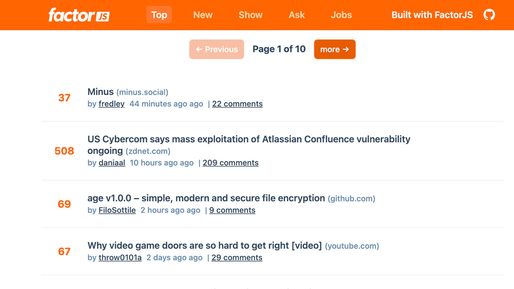

<h1 align="center">Factor - Hacker News Example</h1>

<p align="center">
HackerNews clone built with Factor, Vue and TypeScript.
</p>

<p align="center">
  <a href="https://hacker-news-example.factor.dev" target="_blank">
    
  </a>
</p>

<p align="center">
<a href="https://hacker-news-example.factor.dev" target="_blank"><strong>Live Demo &rarr;</strong></a>
</p>

## About

This is an example of the framework capabilities of Factor. Use it as a reference for core API tools (`@factor/api`) as well as a helpful structure for a typical JS app.

## Features

- Uses flat store + cache (using `stored` and `storeItem` utilities)
- Supports multiple views and routes
- Complete Vue SSR framework
- Real-time updating with animation
- Meta handling with image, title, icon/favicon
- ESlint, Prettier, TypeScript configured

## Docs and Architecture Overview

**Factor docs can be found [here](https://factor.dev).**

## Build Setup

**Requires Node.js LTS+**

```bash
# install dependencies
npm install # or yarn

# serve in dev mode, with hot reload at localhost:8080
npm run dev

# build for production
npm run build

# serve in production mode
npm start
```

## License

MIT
